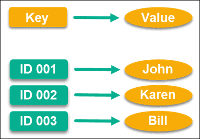
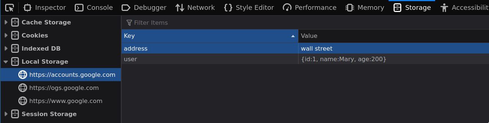
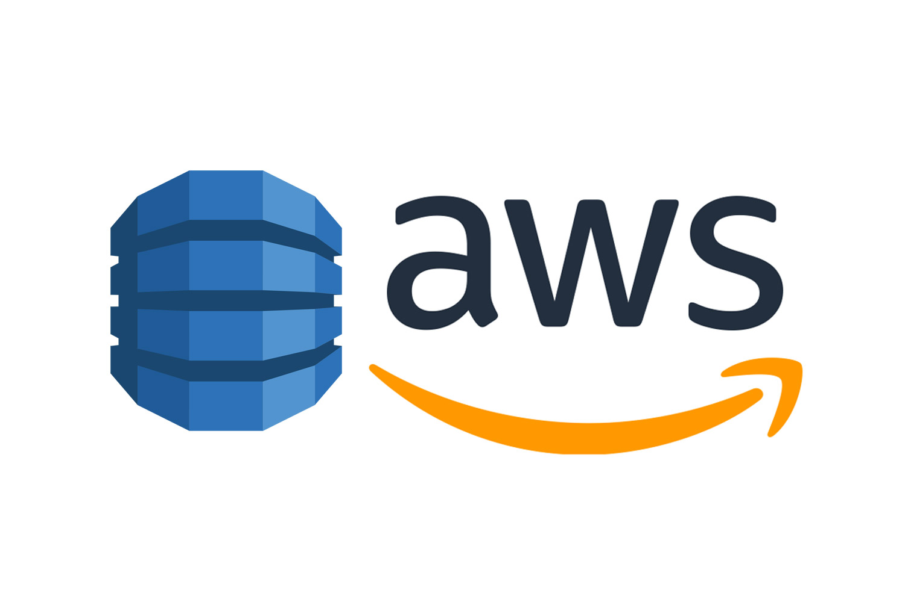
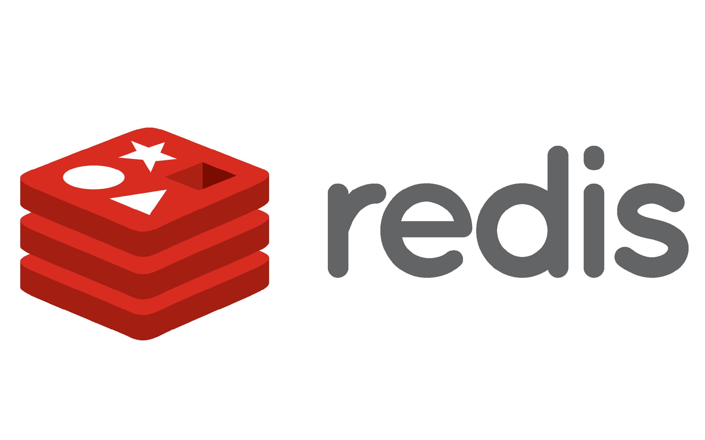

#💿Remix + 🦕Deno KV NoSQL Database

- [ ] Deno KV
  - [ ] Exemplos de DB NoSQL Chave / valor
  - [ ] [Deno KV - Banco de dados global, NoSQL do tipo KEY/VALUE](https://deno.com/kv)
  - [ ] ACID (Atomicidade(transação), Consistência, Isolamento, Durabilidade)
  - [ ] Edge computing
  - [ ] Teste localmente usando o Deno CLI, KV já vem com o DENO!
  - [ ] SQlite local / [Deno Deploy](https://deno.com/deploy)
  - [ ] [FoundationDB](https://www.foundationdb.org/index.html)
  - [ ] [FoundationDB Apple/Github](https://github.com/apple/foundationdb/blob/main/CONTRIBUTING.md#contributing-to-foundationdb)
- [ ] Deno KV usando o CLI
  - [ ] deno --unstable repl
  - [ ] Zero config
  - [ ] Chave composta / primary key
  - [ ] Armazenar e recuperar os dados
  - [ ] Local do banco de dados ?
  - [ ] Alterando / deletando
  - [ ] Criando uma chave secudária
  - [ ] Atomicidade / Transação
  - [ ] Recuperando todos os dados gravados
- [ ] Configuração Remix / VSCode

  - [ ] Criando uma aplicação Remix / Deno
  - [ ] Instalar Plugin Deno oficial
  - [ ] Inicializar VSCode Workspace
  - [ ] TypeScript / deno.json
  - [ ] await top level ? Node14!!
        vim node_modules/@remix-run/dev/dist/compiler/server/compiler.js
        -Mude essa linha target:node14 para target: "node19",
  - [ ] Todo

- [ ] Aplicação demo! Let's go!!!

## Exemplo de chave / valor

